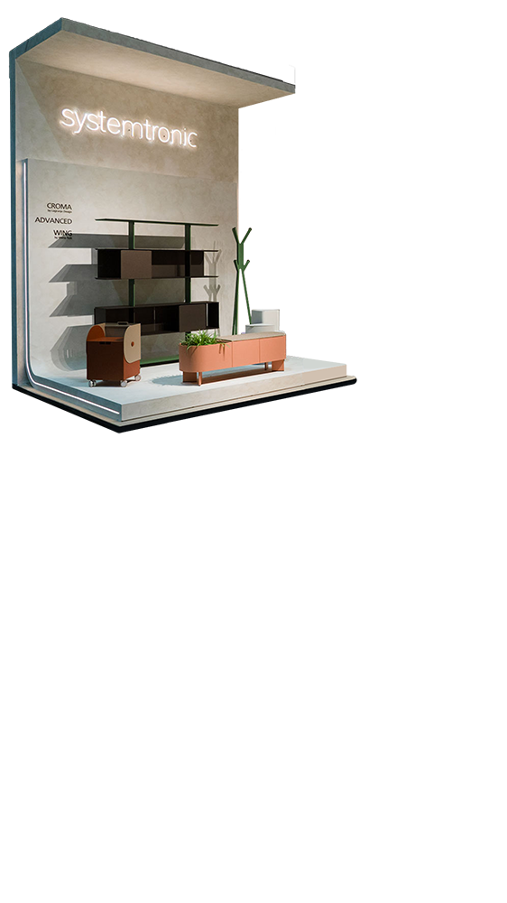

# Ejemplo de Overlays en Versión Móvil - Subsección Hira

## Resumen
Se ha implementado un sistema de overlays de imágenes y textos para la versión móvil de la galería de proyectos, específicamente demostrado en la subsección "Hira" (p1).

## Cambios Realizados

### 1. HTML (index.html)
En la sección `#p1` (Hira) se añadieron:

```html
<div class="image-wrap" id="p1">
  <!-- Fondo móvil existente -->
  
  
  <!-- NUEVO: Overlay de imagen para móvil -->
  
  
  <!-- NUEVO: Texto overlay para móvil -->
  <div class="mobile-text-overlay" 
       style="--text-top: 15%; --text-left: 50%; --text-transform: translateX(-50%); --text-align: center; --text-max-width: 85%;">
    <span data-es="Perchero Hira presentado en la Feria Hábitat Valencia 2025" 
          data-en="Hira Coat Rack presented at Hábitat Valencia Fair 2025"></span>
  </div>
  
  <!-- Elementos de escritorio (ocultos en móvil) -->
  
  
</div>
```

### 2. CSS (styles.css)

#### Estilos para imagen overlay móvil (.mobile-overlay):
- Posicionamiento absoluto sobre el fondo
- Animación de entrada desde abajo con zoom
- Opacidad 0 por defecto, se activa con clase `.visible`
- Transición suave de 0.8s con easing cubic-bezier

#### Estilos para texto overlay móvil (.mobile-text-overlay):
- Tipografía: Montserrat, peso 700
- Color blanco con sombras intensas para legibilidad
- Posicionamiento mediante variables CSS customizables:
  - `--text-top`: posición vertical
  - `--text-left`: posición horizontal
  - `--text-transform`: transformación CSS (ej: translateX(-50%) para centrar)
  - `--text-align`: alineación del texto
  - `--text-max-width`: ancho máximo
- Animación de entrada con blur
- Tamaño de fuente responsive: clamp(16px, 4.5vw, 24px)

#### Reglas de visibilidad:
```css
/* En desktop (>1024px): ocultar overlays móviles */
#galeria .image-wrap > img.mobile-bg,
#galeria .image-wrap > img.mobile-overlay,
#galeria .image-wrap > .mobile-text-overlay { 
  display: none; 
}

/* En móvil/ventanas estrechas (≤1024px): */
@media (max-width: 1024px) {
  /* Ocultar elementos desktop excepto overlays móviles */
  #galeria .image-wrap > :not(.mobile-bg):not(.mobile-overlay):not(.mobile-text-overlay) { 
    display: none !important; 
  }
  
  /* Mostrar y animar overlays móviles */
  #galeria .image-wrap > img.mobile-overlay { display: block !important; }
  #galeria .image-wrap > .mobile-text-overlay { display: block !important; }
}
```

### 3. JavaScript (main.js)

Se añadió el módulo `MobileOverlays`:

```javascript
const MobileOverlays = {
  io: null,
  init() {
    // Solo activar en pantallas móviles/estrechas
    if (window.innerWidth > 1024) return;
    
    // Observador para detectar cuando los image-wrap entran en viewport
    this.io = new IntersectionObserver((entries) => {
      entries.forEach(entry => {
        if (entry.isIntersecting) {
          const wrap = entry.target;
          // Activar overlays de imagen (200ms delay)
          const imgOverlay = wrap.querySelector('.mobile-overlay');
          if (imgOverlay && !imgOverlay.classList.contains('visible')) {
            setTimeout(() => imgOverlay.classList.add('visible'), 200);
          }
          // Activar overlays de texto (400ms delay)
          const textOverlay = wrap.querySelector('.mobile-text-overlay');
          if (textOverlay && !textOverlay.classList.contains('visible')) {
            setTimeout(() => textOverlay.classList.add('visible'), 400);
          }
        }
      });
    }, {
      root: document.getElementById('galeria-container'),
      threshold: 0.3 // Activar cuando el 30% del wrap sea visible
    });
    
    // Observar todos los image-wrap con overlays móviles
    document.querySelectorAll('.image-wrap').forEach(wrap => {
      if (wrap.querySelector('.mobile-overlay') || wrap.querySelector('.mobile-text-overlay')) {
        this.io.observe(wrap);
      }
    });
  }
};
```

El módulo fue añadido a la cadena de inicialización:
```javascript
[Layout, Nav, Overlays, Lang, Intro, Carousel, WebdevMini, ServicesDesc, MobileOverlays].forEach(comp => comp.init());
```

## Cómo Funciona

1. **Carga inicial**: En móvil (≤1024px), los overlays tienen `opacity: 0` y están ligeramente desplazados/difuminados
2. **Detección**: El `IntersectionObserver` monitorea cuando cada `image-wrap` entra en el viewport (30% visible)
3. **Activación secuencial**:
   - Al detectarse, se añade clase `.visible` a la imagen overlay tras 200ms
   - Se añade clase `.visible` al texto overlay tras 400ms
4. **Animación**: Las transiciones CSS hacen que los elementos aparezcan suavemente

## Cómo Replicar en Otras Subsecciones

Para añadir overlays en otras subsecciones (ej: Nostre, Reflejos, etc.):

1. **Añadir elementos en HTML** dentro del `<div class="image-wrap" id="pX">`:
   ```html
   
   <div class="mobile-text-overlay" style="--text-top: Y%; --text-left: X%; ...">
     <span data-es="Texto español" data-en="English text"></span>
   </div>
   ```

2. **Ajustar posicionamiento** mediante variables CSS inline en el atributo `style`:
   - `--text-top`: % desde arriba (ej: `15%`)
   - `--text-left`: % desde izquierda (ej: `50%`)
   - `--text-transform`: para centrar usar `translateX(-50%)`
   - `--text-align`: `left`, `center` o `right`
   - `--text-max-width`: ancho máximo (ej: `85%`)

3. **Colocar la imagen overlay** en la carpeta correcta:
   `assets/Secciones/Proyectos/<NombreProyecto>/movil/`

4. **No requiere cambios en CSS o JS** - el sistema es completamente reutilizable

## Archivos Modificados

- `index.html` - Añadidos overlays en sección p1 (Hira)
- `assets/css/styles.css` - Nuevos estilos para `.mobile-overlay` y `.mobile-text-overlay`
- `assets/js/main.js` - Nuevo módulo `MobileOverlays` y su inicialización

## Recursos Necesarios

Para la subsección Hira ya existen:
- ✅ `assets/Secciones/Proyectos/Hira/movil/fondohira.png` (fondo)
- ✅ `assets/Secciones/Proyectos/Hira/movil/stand.png` (overlay)

## Resultado

En la versión móvil de la galería de proyectos, la subsección Hira ahora muestra:
1. Fondo estático (`fondohira.png`)
2. Imagen overlay del stand que aparece con animación desde abajo
3. Texto descriptivo que aparece con efecto de desenfoque

Todo con animaciones suaves y sincronizadas, similar al comportamiento de la versión de escritorio pero optimizado para la experiencia táctil móvil.
